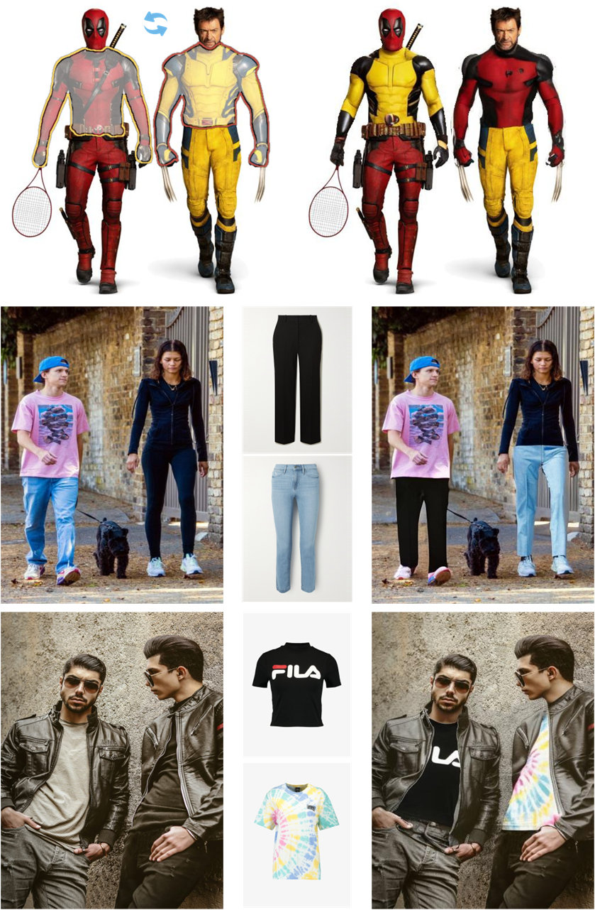
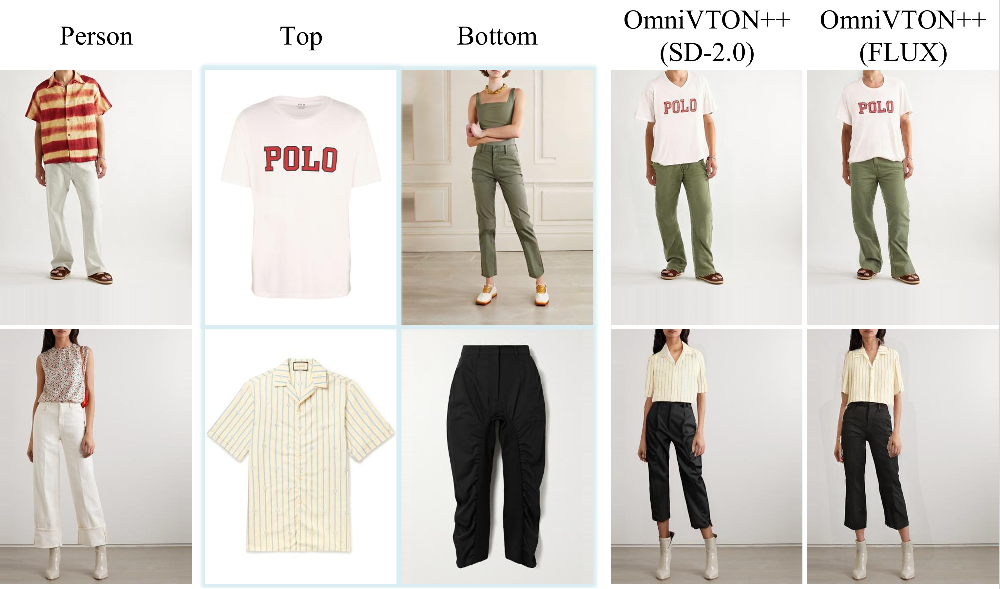

<div align="center">
<h1>OmniVTON++: Training-Free Universal Virtual Try-On with Principal Pose Guidance</h1>

<a href='https://arxiv.org/pdf/2602.14552'></a>
[](https://creativecommons.org/licenses/by-nc/4.0/)


</div>

This is the official implementation of the paper:  
>**OmniVTON++: Training-Free Universal Virtual Try-On with Principal Pose Guidance**<br>  [Zhaotong Yang](https://github.com/Jerome-Young), [Yong Du](https://www.csyongdu.cn/), [Shengfeng He](https://www.shengfenghe.com/), [Yuhui Li](https://github.com/March-rain233), [Xinzhe Li](https://github.com/lixinzhe-ouc), [Yangyang Xu](https://cnnlstm.github.io/), [Junyu Dong](https://it.ouc.edu.cn/djy_23898/main.htm), [Jian Yang](https://teacher.njust.edu.cn/jsj/yj/list.htm)<br>

If interested, star 🌟 this project! 

---
&nbsp;

## Setup
To set up the environment, install requirements using Python 3.12:
```shell
git clone https://github.com/Jerome-Young/OmniVTON-PlusPlus.git
conda create -n omnivton++ python=3.12
conda activate omnivton++
pip install -r requirements.txt
```

## Preparing the Condition Inputs
Before running inference, OmniVTON++ requires a precomputed condition directory for each person-garment pair. 
This directory contains all auxiliary inputs used by the pipeline, including masks, prompts, pose keypoints, human parsing results, and optional DensePose UV files. 

### Agnostic Mask
Generate agnostic mask images following the operation provided by [CAT-DM](https://github.com/zengjianhao/CAT-DM).

### Pseudo Person
Generate a pseudo person image from the target garment, for example using [IMAGDressing](https://github.com/muzishen/IMAGDressing), optionally combined with pose guidance such as ControlNet-Pose.

### Garment Mask
Obtain garment masks for both the origin person image and the pseudo person image.
This can be done using segmentation models such as [SAM](https://github.com/facebookresearch/segment-anything) or [SCHP](https://github.com/GoGoDuck912/Self-Correction-Human-Parsing).  

### OpenPose
Extract 25 keypoint coordinates for both the origin person image and the pseudo person image using [OpenPose](https://github.com/CMU-Perceptual-Computing-Lab/openpose).

### DensePose
Use [DensePose](https://github.com/facebookresearch/detectron2/tree/main/projects/DensePose) to obtain UV maps for the target person image and the pseudo person image. 
DensePose results are used to construct warped densepose guidance, and can also be used to derive human body masks.


### Human Parsing
Generate human parsing maps for both the target person image and the pseudo person image using [TAPPS](https://github.com/tue-mps/tapps).
- Note: To facilitate the extraction of semantic maps, please replace the files in the **official TAPPS** directory with those provided in the `tapps` folder of this repository.

### Metadata and Appearance Cues
Additional metadata should also be prepared and be stored in `meta.json`:
- **skin_color**: estimated from a human parsing result, for example using [SCHP](https://github.com/GoGoDuck912/Self-Correction-Human-Parsing)
- **c_type**: garment category indicator  
  - `0`: upper-body
  - `1`: lower-body
  - `2`: dresses
- **sub_type**: optional lower-body garment subtype for warping logic
  - `0`: trouser
  - `1`: skirt

### Text Prompt
Use the [clip-interrogator](https://github.com/pharmapsychotic/clip-interrogator) to obtain text prompts for both the target garment image and the original garment image.

- Note: If the original garment image is unavailable, you may extract it using a semantic segmentation model and then feed the result into the clip-interrogator.

### Recommended Condition Directory Structure
A typical condition directory should be organized as follows:
```text
condition_dir/
├── agnostic_mask.png
├── cloth_mask.png  # garment mask extracted from the target cloth image
├── parse_mask.png  # origin garment mask
├── densepose_mask.png  # origin body mask
├── pseudo.jpg
├── pseudo_mask.png  # pseudo garment mask
├── human_pose.json  # origin openpose
├── cloth_pose.json  # pseudo openpose
├── human_parsing.png  # origin tapps
├── cloth_parsing.png  # pseudo tapps
├── cloth_prompt.json
├── meta.json
├── image_uv.pkl  # origin densepose uv
└── cloth_uv.pkl  # pseudo densepose uv
```

## Usage
To generate a pseudo person image, run the following command:
```shell
python inference.py \
  --model-id sd2_inp \
  --image-path sample_data/person.jpg \
  --cloth-path sample_data/cloth.jpg \
  --condition-dir sample_data \
  --H 512 --W 384 \
  --output-path OUTPUT_PATH
```
`--model-id` specifies the baseline model for virtual try-on. The following baseline models are supported by the script:
- `sd2_inp` - Stable Diffusion 2.0 Inpainting
- `sd15_inp` - Stable Diffusion 1.5 Inpainting
- `flux_inp` - Flux.fill

The script uses a combination of positive and negative prompts by default to achieve more visually appealing results.

On the first run, it will automatically download the required models — please be patient. Alternatively, you may choose to load models from a local directory.

---  

## Multi-Human Results
&nbsp;

## Multi-Garment Results
&nbsp;

## Anime Character Results
&nbsp;

## Acknowledgements
We thank [HD-Painter](https://github.com/Picsart-AI-Research/HD-Painter) for the base code framework.

We thank [CAT-DM](https://github.com/zengjianhao/CAT-DM) for the agnostic mask generation code.

We thank [TAPPS](https://github.com/tue-mps/tapps) and [OpenPose](https://github.com/CMU-Perceptual-Computing-Lab/openpose) for human parsing.

We thank [SCHP](https://github.com/GoGoDuck912/Self-Correction-Human-Parsing) for human segmentation.

We thank [DensePose](https://github.com/facebookresearch/detectron2/tree/main/projects/DensePose) for human densepose.

## Citation

If you find our work useful for your research, please cite us:
```
@article{yang2026omnivton++,
  title={OmniVTON++: Training-Free Universal Virtual Try-On with Principal Pose Guidance},
  author={Yang, Zhaotong and Du, Yong and He, Shengfeng and Li, Yuhui and Li, Xinzhe and Xu, Yangyang and Dong, Junyu and Yang, Jian},
  journal={arXiv preprint arXiv:2602.14552},
  year={2026}
}
```
